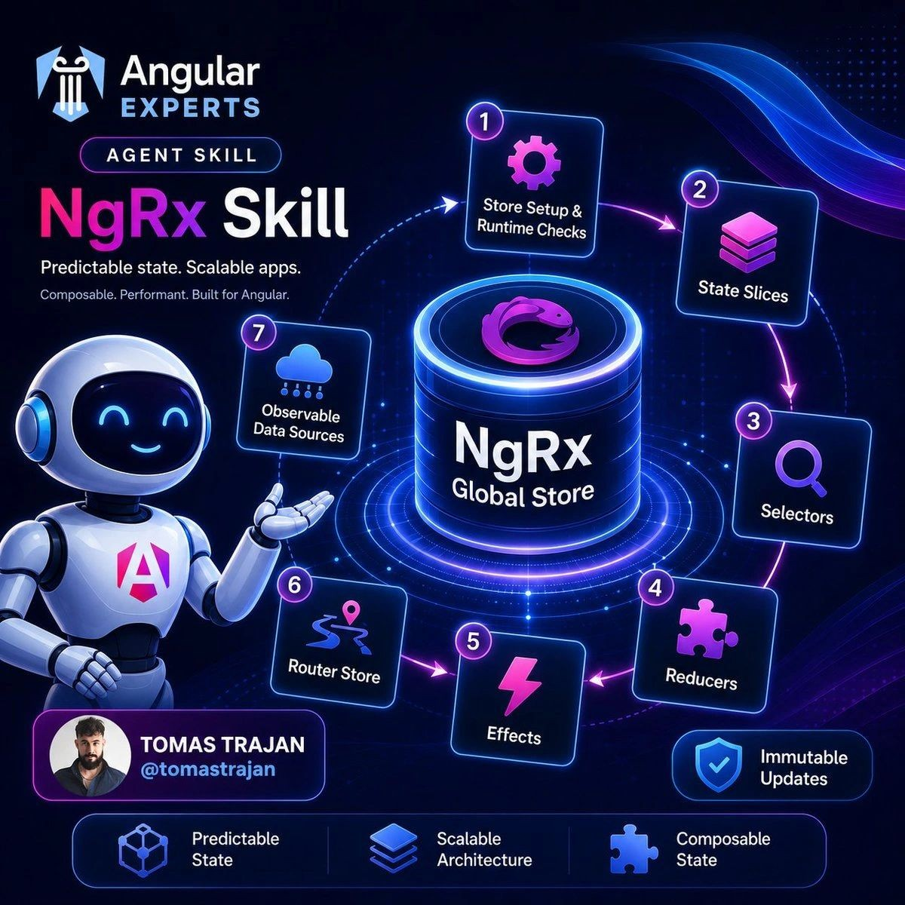

# Angular Experts Skills ax-skills

by [@tomastrajan](https://x.com/tomastrajan)

A curated collection of mostly handcrafted skills encoding more than a decade of best practices, proven patterns, and lessons learned for Angular frontend development, from SaaS MVPs to enterprise-scale environments.

## Skills

### [Angular Enterprise Architecture](angular-enterprise-architecture/SKILL.md)

Guidance for building and evolving maintainable, extendable enterprise-grade Angular applications with a standalone-first architecture, isolated lazy business features, reusable ui and pattern building blocks, one-way dependency graph rules, and tooling-based automated architecture validation.

Based on the [Angular Enterprise Architecture eBook](https://angularexperts.io/products/ebook-angular-enterprise-architecture/) by Tomas Trajan [@tomastrajan](https://x.com/tomastrajan), this skill translates the book's proven Angular architecture approach into agent-ready rules for new projects, existing project improvements, and long-term consistency across teams.

Handles:

- Placement decisions for `core`, `layout`, `ui`, `feature`, `pattern`, app/helper building blocks, and libraries.
- Lazy feature isolation, nested lazy sub-features, and the extract-one-level-up rule.
- Standardized building block definitions and dependency allow rules.
- Reusable `eslint-plugin-boundaries` config for IDE and CI-based architecture validation.
- Repeatable patterns for sharing code without breaking lazy loading, feature isolation, or the one-way dependency graph.

### [NgRx](ngrx/SKILL.md)

Guidance for implementing and modifying NgRx state management in Angular applications.
Predictable state. Scalable apps. Composable, performant, and built for Angular.

Handles:

- State management architecture, read/write boundaries, and container/UI component responsibilities.
- State modeling, serializability, and error modeling.
- Global store setup and runtime checks.
- State slices, lazy feature boundaries, and slice extraction.
- Selectors and state consumption in container components.
- Reducers and immutable state updates.
- Effects for backend requests, navigation, deep linking, URL synchronization, scrolling, and route-driven data loading.
- NgRx router-store registration and router selector factories.
- Observable data sources exposed through selectors.

